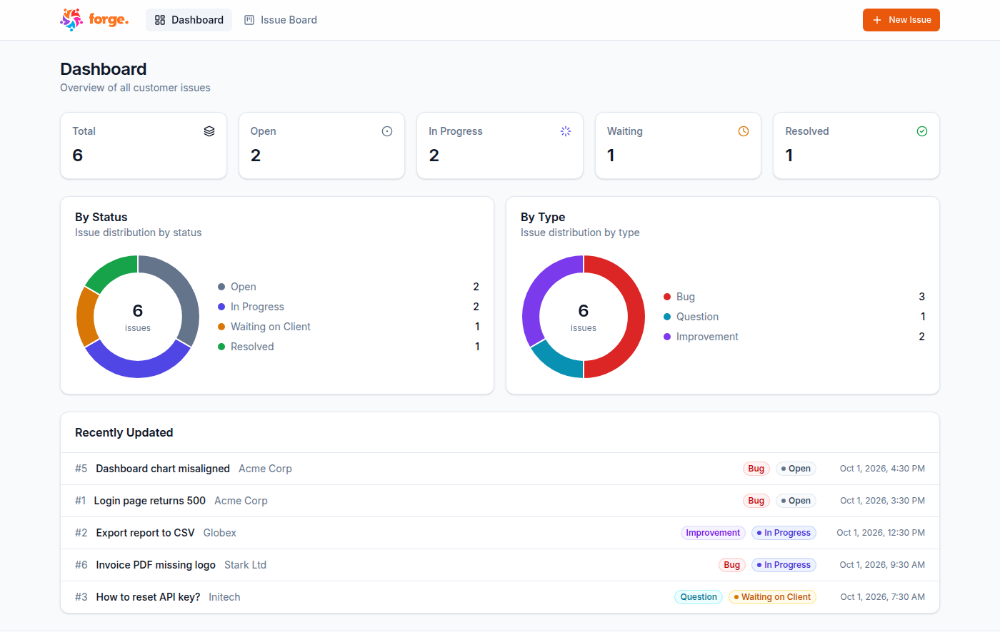
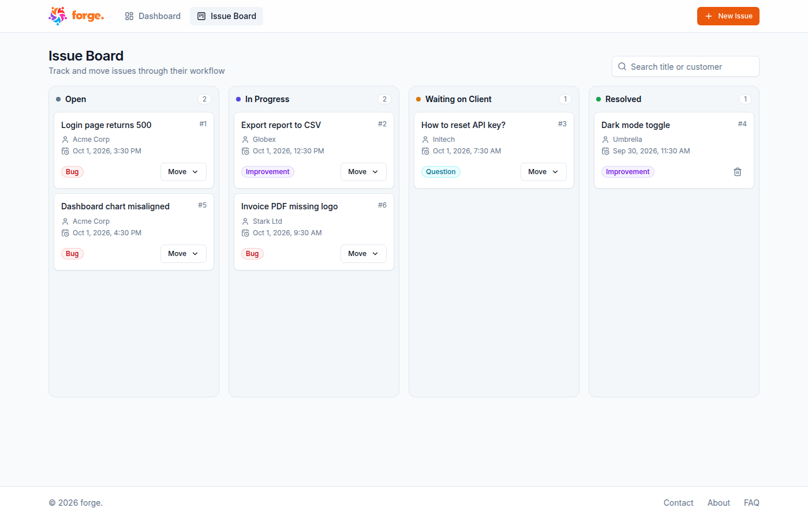
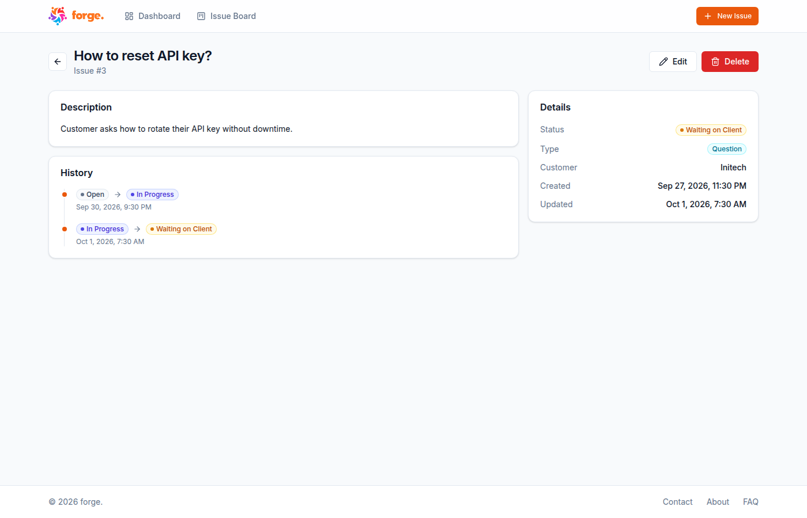
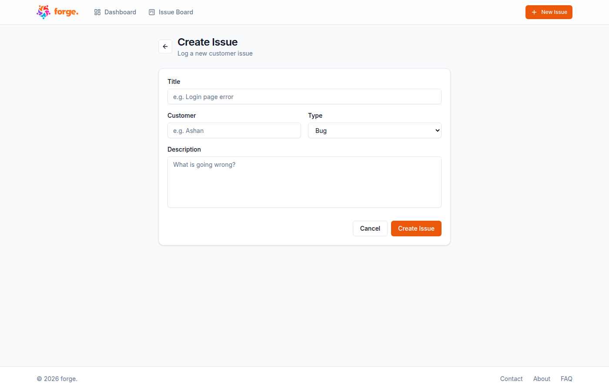
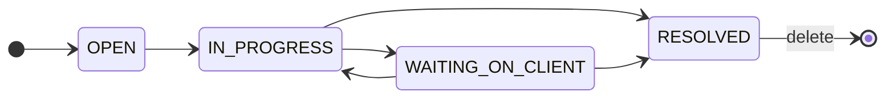
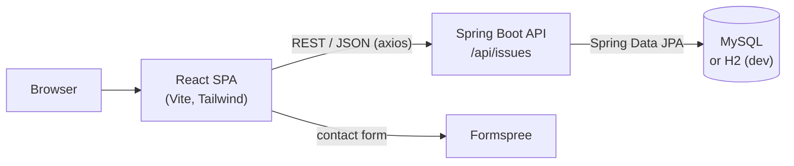

<p align="center">
  
</p>

<h1 align="center">forge. — Issue Tracker</h1>

<p align="center">
  A lightweight, Jira-style issue tracker for logging customer issues and moving them through a support workflow.
  <br />
  <b>Frontend</b> (this repo) · <a href="https://github.com/AshanOdi/jiraclone-Backend">Backend</a>
</p>

<p align="center">
  
  
  
  
  
</p>

---

## Overview

forge. is a full-stack project split into two repositories:

| Repo | What it is |
| --- | --- |
| **[jiraclone-Frontend](https://github.com/AshanOdi/jiraclone-Frontend)** (this repo) | React single-page app: dashboard, Kanban board and issue forms |
| **[jiraclone-Backend](https://github.com/AshanOdi/jiraclone-Backend)** | Spring Boot REST API with JPA, backed by MySQL (or H2 for local development) |

Each issue has a **type** (Bug, Question, Improvement) and a **status** that moves through a support workflow. Every status change is saved, so each issue keeps a full history.

## Screenshots

| Dashboard | Issue Board |
| --- | --- |
|  |  |

| Issue Detail | Create Issue |
| --- | --- |
|  |  |

## Features

- **Dashboard**: count tiles per status, doughnut charts by status and type, and a list of recently updated issues
- **Kanban issue board**: one column per status, live search by title or customer, and a **Move** menu that offers only the valid next statuses
- **Create, edit and delete** issues, with toast notifications for success and errors
- **Issue detail page**: description, details panel and a **status history timeline**
- **Contact page**: message form sent through [Formspree](https://formspree.io), plus About and FAQ
- **Responsive layout**: works from mobile to wide screens
- **Resilient UI**: route guard for pages opened without an issue, empty states, and safe handling of unexpected API responses

## Issue workflow



New issues always start as `OPEN`. The board's Move menu follows this flow (defined in [`src/lib/issues.js`](src/lib/issues.js)). The edit form can set any status directly.

## Architecture



## Tech stack

**Frontend (this repo)**

| Area | Tools |
| --- | --- |
| Framework | React 19, Vite 7 |
| Routing | React Router 7 |
| Styling | Tailwind CSS 4 with design tokens (`@theme`), Inter font |
| UI components | Own shadcn/ui-style components (`Button`, `Card`, `Badge`, form fields), built with `clsx` + `tailwind-merge` |
| Icons | lucide-react |
| Charts | Chart.js + react-chartjs-2 (doughnut) |
| HTTP / feedback | axios, react-hot-toast |
| Quality | ESLint 9 |

**Backend ([jiraclone-Backend](https://github.com/AshanOdi/jiraclone-Backend))**: Java 24, Spring Boot 3.5 (Web, Data JPA), Hibernate, MySQL, H2 (dev profile), Lombok, Maven Wrapper.

## Project structure

```
src/
├── App.jsx                 # routes and app layout (header, main, footer)
├── index.css               # Tailwind import + design tokens
├── lib/
│   ├── api.js              # backend base URL
│   ├── issues.js           # status/type labels, colors, allowed next statuses, date format
│   └── utils.js            # cn() class-name helper
├── components/
│   ├── ui/                 # Button, Card, Badge, Input/Select/Textarea/Label
│   ├── header.jsx, footer.jsx, pageHeader.jsx
│   ├── board.jsx, column.jsx, card.jsx, statusMenu.jsx   # Kanban board
│   ├── countCard.jsx, summeryBoard.jsx, pieChart.jsx     # dashboard widgets
│   ├── issueBadges.jsx     # StatusBadge, TypeBadge
│   └── requireIssue.jsx    # route guard for detail/edit pages
└── pages/
    ├── homePage.jsx        # dashboard
    ├── allIssuePage.jsx    # board
    ├── createIssuePage.jsx, editIssuePage.jsx, issueDetailPage.jsx
    └── contactPage.jsx
```

## Getting started

### Prerequisites

- Node.js 20.19+ and npm
- The backend running on `http://localhost:8080`. See the [backend README](https://github.com/AshanOdi/jiraclone-Backend#getting-started); it can run with **no database install** using its H2 dev profile.

### Run the frontend

```bash
git clone https://github.com/AshanOdi/jiraclone-Frontend.git
cd jiraclone-Frontend
npm install
npm run dev          # http://localhost:5173
```

### Configuration

| Variable | Default | Description |
| --- | --- | --- |
| `VITE_BACKEND_URL` | `http://localhost:8080` | Base URL of the Spring Boot API |

To point at another backend, create a `.env` file:

```bash
echo "VITE_BACKEND_URL=https://your-api.example.com" > .env
```

### Scripts

| Command | Description |
| --- | --- |
| `npm run dev` | Start the dev server with hot reload |
| `npm run build` | Production build into `dist/` |
| `npm run preview` | Preview the production build |
| `npm run lint` | Run ESLint |

## API used by the frontend

| Method | Endpoint | Used for |
| --- | --- | --- |
| `GET` | `/api/issues` | Dashboard and board |
| `POST` | `/api/issues` | Create issue |
| `PUT` | `/api/issues/{id}` | Edit issue |
| `PUT` | `/api/issues/{id}/status` | Move status (records history) |
| `DELETE` | `/api/issues/{id}` | Delete issue |

Full API details are in the [backend README](https://github.com/AshanOdi/jiraclone-Backend#api-reference).

## Author

**Ashan Odithya** · [GitHub @AshanOdi](https://github.com/AshanOdi)
